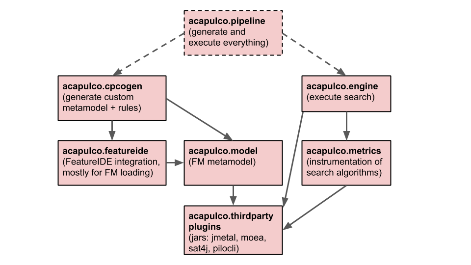
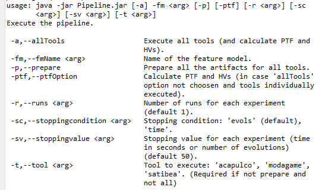

# acapulco

## Project structure

The image below explains the project structure ([editable source](https://docs.google.com/presentation/d/1zrxTfQnYK6VBkblaSKF1hr0gAGKRlGz8-E12-qcwU3g/edit#slide=id.p)).

## New pipeline

#### Use cases:

1. Preparation of all artifacts for all tools:
`-p -fm WeaFQAs` (without extensions file)

2. Execute the experiments for a specific tool:
`-fm WeaFQAs -t acapulco -sc evols -sv 50 -runs 30`

3. Execute the experiments for all tools and calculate the PTF and HVs:
`-fm WeaFQAs -a -sc evols -sv 50 -runs 30`

4. Generate PTF and calculate HVs (from previous results):
`-fm WeaFQAs -ptf -runs 30`

Use this latest use case in case individual execution of the tools (maybe due to large feature models).
